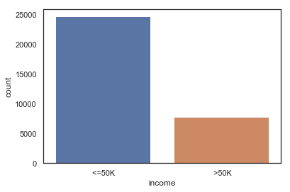
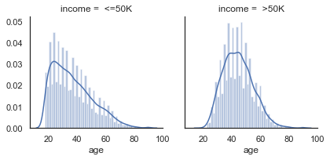
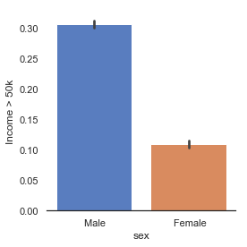
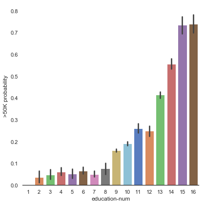
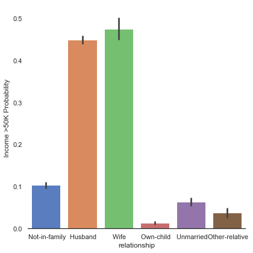
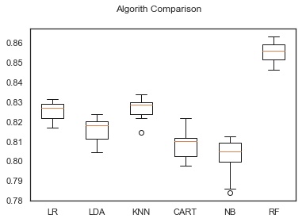

# Predicting and Analyzing income using Census Dataset

We will use the census data set, to predict annual income greater or less than 50k using classification method.<br>
Created by <i>LuccasDev</i>
Follow me :)

## • Let's go analyze the dataset


```python
import pandas as pd
import numpy as np
import matplotlib.pyplot as plt
import seaborn as sns
%matplotlib inline

from collections import Counter

from sklearn.ensemble import RandomForestClassifier, AdaBoostClassifier, GradientBoostingClassifier, ExtraTreesClassifier, VotingClassifier
from sklearn.discriminant_analysis import LinearDiscriminantAnalysis
from sklearn.linear_model import LogisticRegression
from sklearn.neighbors import KNeighborsClassifier
from sklearn.tree import DecisionTreeClassifier
from sklearn.neural_network import MLPClassifier
from sklearn.naive_bayes import GaussianNB
from sklearn.ensemble import RandomForestClassifier
from sklearn.model_selection import GridSearchCV, cross_val_score, StratifiedKFold, learning_curve, train_test_split, KFold
from sklearn.metrics import classification_report
from sklearn.metrics import confusion_matrix
from sklearn.metrics import accuracy_score


df = pd.read_csv('dataset\\census.csv')
df.describe()
```


<div>

<table border="1" class="dataframe">
  <thead>
    <tr style="text-align: right;">
      <th></th>
      <th>age</th>
      <th>final-weight</th>
      <th>education-num</th>
      <th>capital-gain</th>
      <th>capital-loos</th>
      <th>hour-per-week</th>
    </tr>
  </thead>
  <tbody>
    <tr>
      <th>count</th>
      <td>32561.000000</td>
      <td>3.256100e+04</td>
      <td>32561.000000</td>
      <td>32561.000000</td>
      <td>32561.000000</td>
      <td>32561.000000</td>
    </tr>
    <tr>
      <th>mean</th>
      <td>38.581647</td>
      <td>1.897784e+05</td>
      <td>10.080679</td>
      <td>1077.648844</td>
      <td>87.303830</td>
      <td>40.437456</td>
    </tr>
    <tr>
      <th>std</th>
      <td>13.640433</td>
      <td>1.055500e+05</td>
      <td>2.572720</td>
      <td>7385.292085</td>
      <td>402.960219</td>
      <td>12.347429</td>
    </tr>
    <tr>
      <th>min</th>
      <td>17.000000</td>
      <td>1.228500e+04</td>
      <td>1.000000</td>
      <td>0.000000</td>
      <td>0.000000</td>
      <td>1.000000</td>
    </tr>
    <tr>
      <th>25%</th>
      <td>28.000000</td>
      <td>1.178270e+05</td>
      <td>9.000000</td>
      <td>0.000000</td>
      <td>0.000000</td>
      <td>40.000000</td>
    </tr>
    <tr>
      <th>50%</th>
      <td>37.000000</td>
      <td>1.783560e+05</td>
      <td>10.000000</td>
      <td>0.000000</td>
      <td>0.000000</td>
      <td>40.000000</td>
    </tr>
    <tr>
      <th>75%</th>
      <td>48.000000</td>
      <td>2.370510e+05</td>
      <td>12.000000</td>
      <td>0.000000</td>
      <td>0.000000</td>
      <td>45.000000</td>
    </tr>
    <tr>
      <th>max</th>
      <td>90.000000</td>
      <td>1.484705e+06</td>
      <td>16.000000</td>
      <td>99999.000000</td>
      <td>4356.000000</td>
      <td>99.000000</td>
    </tr>
  </tbody>
</table>
</div>


On describe we can see the minimal age as 17 years ago and maximum age as 90 years ago.


```python
data = df.iloc[:, 0:14].values
target = df.iloc[:, 14].values
```

Show the income count, more than 50k vs more less 50k.


```python
sns.countplot(df['income'],label="Count")
plt.show()
```





## Income / Age


```python
g = sns.FacetGrid(df, col='income')
g = g.map(sns.distplot, "age")
plt.show()
```





Transform target to 0 or 1 (0 for <=50k, 1 for > 50k).


```python
from sklearn.preprocessing import LabelEncoder, OneHotEncoder

labelEncoder_classe = LabelEncoder()
df['income'] = labelEncoder_classe.fit_transform(target)
```

## Income > 50k : Male vs Female


```python
g = sns.catplot(x="sex",y="income",data=df,kind="bar" ,height=4,
palette = "muted")
g.despine(left=True)
g = g.set_ylabels("Income > 50k")
plt.show()
```





## Education Num vs Income


```python
g = sns.catplot(x="education-num",y="income",data=df,kind="bar",height=6,palette="muted")
g.despine(left=True)
g = g.set_ylabels(">50K probability")
```





## Relationship vs Income


```python
g = sns.catplot(x="relationship",y="income",data=df,kind="bar",height=6,palette="muted")
g.despine(left=True)
g = g.set_ylabels("Income >50K Probability")
plt.show()
```





## Now transform features


```python
from sklearn.preprocessing import LabelEncoder, OneHotEncoder

labelEncoder= LabelEncoder()
data[:, 1] = labelEncoder.fit_transform(data[:, 1])
data[:, 3] = labelEncoder.fit_transform(data[:, 3])
data[:, 5] = labelEncoder.fit_transform(data[:, 5])
data[:, 6] = labelEncoder.fit_transform(data[:, 6])
data[:, 7] = labelEncoder.fit_transform(data[:, 7])
data[:, 8] = labelEncoder.fit_transform(data[:, 8])
data[:, 9] = labelEncoder_previsores.fit_transform(data[:, 9])
data[:, 13] = labelEncoder.fit_transform(data[:, 13])
```

## Scheduling 


```python
from sklearn.preprocessing import StandardScaler

scaler = StandardScaler()
data = scaler.fit_transform(data)

```

## Create Model


```python
validation_size = 0.20
seed = 7
num_folds = 10
scoring = 'accuracy'
X_train, X_validation, Y_train, Y_validation = train_test_split(data,target,
    test_size=validation_size,random_state=seed)

# Params for Random Forest
num_trees = 100
max_features = 3

#Spot Check 5 Algorithms (LR, LDA, KNN, CART, GNB, SVM)
models = []
models.append(('LR', LogisticRegression()))
models.append(('LDA', LinearDiscriminantAnalysis()))
models.append(('KNN', KNeighborsClassifier()))
models.append(('CART', DecisionTreeClassifier()))
models.append(('NB', GaussianNB()))
models.append(('RF', RandomForestClassifier(n_estimators=num_trees, max_features=max_features)))
#models.append(('SVM', SVC()))

# evalutate each model in turn
results = []
names = []
for name, model in models:
    kfold = KFold(n_splits=10, random_state=seed)
    cv_results = cross_val_score(model, X_train, Y_train, cv=kfold, scoring='accuracy')
    results.append(cv_results)
    names.append(name)
    msg = "%s: %f (%f)" % (name, cv_results.mean(), cv_results.std())
    print(msg)
```

    LR: 0.825591 (0.004918)
    LDA: 0.815840 (0.005894)
    KNN: 0.826781 (0.005494)
    CART: 0.808469 (0.006892)
    NB: 0.802020 (0.009341)
    RF: 0.855344 (0.004833)
    


```python
figure = plt.figure()
figure.suptitle('Algorith Comparison')
ax= figure.add_subplot(111)
plt.boxplot(results)
ax.set_xticklabels(names)
plt.show()
```





## Best algorithm score is RF, accuracy: 0.85


```python
random_forest = RandomForestClassifier(n_estimators=250,max_features=5)
random_forest.fit(X_train, Y_train)
predictions = random_forest.predict(X_validation)
print("Accuracy: %s%%" % (100*accuracy_score(Y_validation, predictions)))
print(confusion_matrix(Y_validation, predictions))
print(classification_report(Y_validation, predictions))
```

    Accuracy: 85.90511285122064%
    [[4605  346]
     [ 572  990]]
                 precision    recall  f1-score   support
    
              0       0.89      0.93      0.91      4951
              1       0.74      0.63      0.68      1562
    
    avg / total       0.85      0.86      0.86      6513
    

Follow me :)
